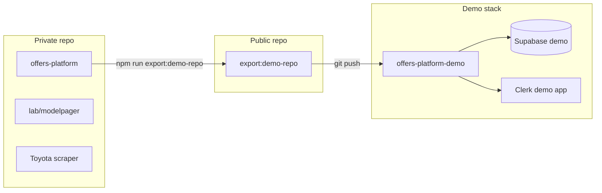

# Public demo repo & hosted demo

Keep your **main repo private** (real dealer configs, ingestion credentials, `lab/`). Publish a **sanitized export** for portfolio visitors and wire it to a separate Vercel stack.

## Architecture



| Resource | Production | Demo / portfolio |
|----------|------------|------------------|
| GitHub | Private `offers-platform` | Public `offers-platform-demo` (export only) |
| Vercel | `offers-platform` | `offers-platform-demo` |
| Supabase | Production DB | **Separate** project |
| Clerk | Production app | **Separate** app (invite-only) |
| LLM keys | Operator keys in env | **BYOK** (see below) or omit entirely |

`DEMO_MODE` scrubs the **live site** (fictional store names, demo asset URLs). The **export script** scrubs the **GitHub tree** (Demo URLs, addresses, phones, etc.).

---

## 1. Export a public tree

From your private checkout:

```bash
npm run export:demo-repo -- ../offers-platform-demo --force
```

The script:

- Copies the repo minus `lab/`, `artifacts/`, `tools/`, `docs/internal/`, `.playwright/`, `.env*`, all `.xlsx`, BMW fixtures, Toyota ingestion script/CI
- Runs a text sanitization pass on `lib/`, `app/`, tests, docs
- **Fails** if forbidden dealer strings remain (e.g. `Demo`, real phone patterns)
- Writes `PORTFOLIO_README.md` and `export-manifest.json`

Review the diff before publishing:

```bash
cd ../offers-platform-demo
git diff --stat   # first commit: git add . && git status
```

---

## 2. Publish to GitHub

```bash
cd ../offers-platform-demo
git init
git add .
git commit -m "Portfolio demo export (sanitized)"
gh repo create offers-platform-demo --public --source=. --push
```

Do **not** point the public repo at production secrets. Never copy `.env.local` into the export.

---

## 3. Vercel demo project

Create **`offers-platform-demo`** linked to the **public** repo.

### Required env

| Variable | Value |
|----------|--------|
| `DATABASE_URL` / `DIRECT_URL` | Demo Supabase only |
| `CLERK_*` | Demo Clerk app |
| `ADMIN_EMAILS` / `ALLOWED_EMAILS` | Your demo operator email(s) |
| `DEMO_MODE` | `true` |
| `NEXT_PUBLIC_DEMO_MODE` | `true` |
| `DEMO_ASSET_BASE_URL` | `https://<demo-host>/demo/assets` (optional) |
| `MODELPAGER_CONFIGS` | `demo/modelpager-configs` (optional; auto when `DEMO_MODE=true`) |

### LLM (recommended: BYOK)

| Variable | Value |
|----------|--------|
| `DEMO_LLM_BYOK` | `true` |
| `NEXT_PUBLIC_DEMO_LLM_BYOK` | `true` |
| `LLM_PROVIDER` | `anthropic` (or `openai`) |
| `ANTHROPIC_MODEL*` / `OPENAI_MODEL*` | Model ids only — **no API keys** |
| `DEMO_LLM_RATE_LIMIT` | `10` (requests per user/IP per window) |
| `DEMO_LLM_RATE_WINDOW_MS` | `3600000` (1 hour) |

**Omit** `OPENAI_API_KEY` and `ANTHROPIC_API_KEY` on demo when BYOK is on.

Signed-in visitors paste a key on **Admin → Model pages** (stored in `sessionStorage` only). Bulk generate sends `X-Demo-Llm-Api-Key` to your API, which forwards it to the provider for that request.

### Do not set on demo

- `DEMO_MODE` on production (inverse)
- Production `DATABASE_URL` / Clerk keys
- `GITHUB_TOKEN` / Toyota Playwright paths (ingestion is excluded and blocked)

---

## 4. Database

After first deploy:

```bash
# With demo DATABASE_URL / DIRECT_URL in shell or .env
npm run db:migrate
npm run db:seed-demo
```

Re-run `db:seed-demo` after schema changes or when you want fresh fictional offers.

---

## 5. Ongoing workflow

1. Develop in **private** repo.
2. When you want the portfolio updated: re-run `export:demo-repo --force`, commit, push public repo.
3. Vercel demo auto-deploys from public `main`.
4. Production deploys from **private** repo only (separate Vercel project).

Production and demo only both update on one `git push` if you mistakenly wire both to the same remote — keep them on different repos or branches intentionally.

---

## 6. LLM options for the demo site

There is **no fully free, operator-zero-cost** way to let anonymous visitors run unlimited LLM calls on your infrastructure. Options:

### A. Bring your own key (recommended, $0 for you)

- Enable `DEMO_LLM_BYOK` (above).
- Each signed-in visitor uses **their** Anthropic/OpenAI account.
- You pay nothing; abuse is limited by Clerk auth + rate limits.
- Tradeoff: visitors need their own provider account (many have free trial credits).

### B. Operator-funded demo key (small cost, simpler UX)

- Set a **separate** low-spend-limit API key on demo only.
- Keep strict `DEMO_LLM_RATE_LIMIT` and invite-only Clerk.
- Expect some bill; cap spend in the provider dashboard.

### C. Disable LLM on demo

- Leave `DEMO_LLM_BYOK=false` and omit API keys.
- Portfolio still shows offers admin, disclaimers, renderers, widget — not live generation.

### D. “Free tier” providers (Groq, Gemini, etc.)

- Would require code changes to add providers; still need **some** operator account and keys.
- Free tiers are capped and not a substitute for BYOK for a public portfolio.

**Not recommended:** embedding a shared key in client-side code — it will be extracted and abused.

---

## 7. Model pages on demo

The export includes **`demo/modelpager-configs/`** — fictional stores and small model lists (3–4 models per brand). When `DEMO_MODE=true`, the app uses this tree automatically (or set `MODELPAGER_CONFIGS=demo/modelpager-configs` explicitly).

Production keeps real configs in private **`lab/modelpager/configs`** (never exported).

With **BYOK** enabled, signed-in visitors can bulk-generate pages for the demo catalog without operator LLM keys.

---

## 8. Checklist

- [ ] Main repo is **private**
- [ ] Export passes without forbidden-string errors
- [ ] Public repo has no `.env` files
- [ ] Demo Vercel uses demo Supabase + Clerk
- [ ] `DEMO_MODE` + `NEXT_PUBLIC_DEMO_MODE` on demo only
- [ ] LLM: BYOK enabled **or** keys omitted entirely
- [ ] `npm run db:seed-demo` run against demo DB
- [ ] Smoke: sign in, offers list, Admin → Embed (`/admin/embed`), optional model-page generate with your own key
